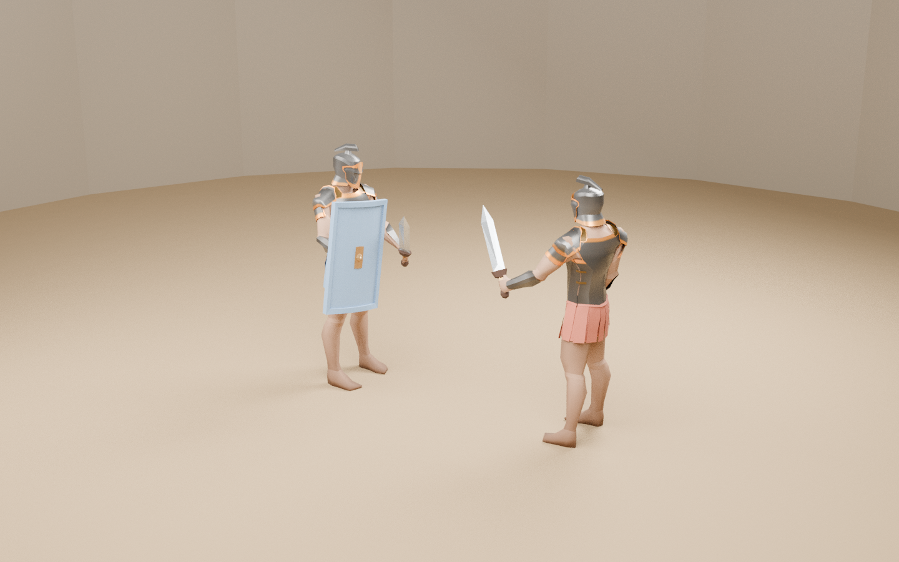

# Iron Sand Arena — 角鬥士模型與渲染成果

本目錄保存已發布的實際 3D 模型、Blender 場景及離線渲染圖。**這些 PNG 是 Blender 渲染，不是 Unity 遊戲截圖；資產發布完成不代表遊戲內驗收通過。**

## 預覽



[持盾待命](gladiator_guard.png) · [背面](gladiator_rear.png) · [舉劍姿勢](gladiator_strike.png)

## 檔案入口

| 檔案 | 用途 |
| --- | --- |
| [IronSand_Gladiator.fbx](IronSand_Gladiator.fbx) | 角色模型、骨架與短姿勢示範的 FBX 匯出；不是完整戰鬥動畫庫。 |
| [IronSand_Gladiator.glb](IronSand_Gladiator.glb) | GLB 模型與短姿勢示範，供模型檢視及交換。 |
| [IronSand_Gladiator_Stage.blend](IronSand_Gladiator_Stage.blend) | 含材質、燈光與展示配置的 Blender 場景。 |
| [render_manifest.json](render_manifest.json) | 渲染設定、檔案大小及 SHA-256。 |
| [CREDITS.md](CREDITS.md) | 第三方素材來源、作者、授權與修改紀錄。 |

遊戲實際使用的共用網格、UV、16 骨骼蒙皮資料及貼圖位於 [Assets/Resources/Gladiators](../../Assets/Resources/Gladiators)。載入程式位於 [Assets/Scripts/Art](../../Assets/Scripts/Art)。此目錄的 FBX/GLB 不是目前 runtime 載入來源；runtime 由 `ImportedGladiatorVisual` 讀取 `Gladiator.json` 建立 `SkinnedMeshRenderer`，並由既有 Combat V2 訊號驅動。

## 本輪 GitHub 同步核對

- 核對日期：2026-09-14。
- 資產發布提交：`c4856d7e4b909ad7616e05f57711e6b9769a9742`。
- 已將交付 ZIP 中 8 個 `ArtExports` 檔案與 5 個 `Assets/Resources/Gladiators` 檔案，逐一對照該提交的 Git tree；共 **13 個檔案**的 byte count 與 Git blob SHA 一致。`ArtExports/` 對應本目錄 `Art/Gladiator/`。
- ZIP SHA-256：`0418e8a6fed659eccceb52c986f63198fb69d9db748d07bd9283ea8bf175eb16`。
- 本輪沒有重複上傳相同二進位檔，也沒有用舊修補包覆蓋 Combat V2。僅補充本頁及 PR 交付紀錄；main 未修改。
- 此核對只證明檔案一致，不是新的編譯、渲染或 Unity 測試結果。

詳細證據見 [資產發布清單](../../docs/GLADIATOR_ASSET_RECEIPT.json) 與 [渲染／整合報告](../../docs/GLADIATOR_RENDER_REPORT.md)。

## 本機更新

先保存本機修改。在工作目錄乾淨、或已妥善處理修改後執行：

```bash
git status
git fetch origin
git switch feat/arena-prototype-v0.1.0
git pull --ff-only origin feat/arena-prototype-v0.1.0
git log -1 --oneline
```

若 Git 回報衝突或分支分歧，停止並保留現有修改；不要使用 reset --hard、clean 或 force push。

以 Unity `6000.3.23f1` 開啟專案。更新自舊生成場景時，先備份手動修改的場景、退出 Play Mode，再執行 **Tools > Iron Sand Arena > Rebuild Prototype Arena**。

進入 Play Mode 後核對 `Imported_CC0_Gladiator`、16 骨骼 `SkinnedMeshRenderer`，以及 `ProceduralCombatRig.UsesImportedModel == true`。若出現 primitive fallback 警告，表示模型接入檢查未通過。完整驗證依 [本機驗證工作包](../../docs/LOCAL_VALIDATION_WORKPACK.md) 與 [驗收清單](../../docs/VALIDATION.md) 執行。

## 尚未通過的驗收

Unity U1–U7 仍為 **NOT_RUN**：匯入、Unity 編譯、EditMode/PlayMode、操作、AI/觀眾、相機／手感、Standalone／長時間穩定性均不得以 Blender 渲染代替。CI 必須以實際受測提交的結果為準，不沿用舊提交的 PASS。

已知美術限制仍包括部分舉劍姿勢的盾牌／腰裙穿插、程序化而非精修的動作，以及斧／長矛／戰槌的替代模型。PR #1 保持 Draft，不代表合併或發布核准。
